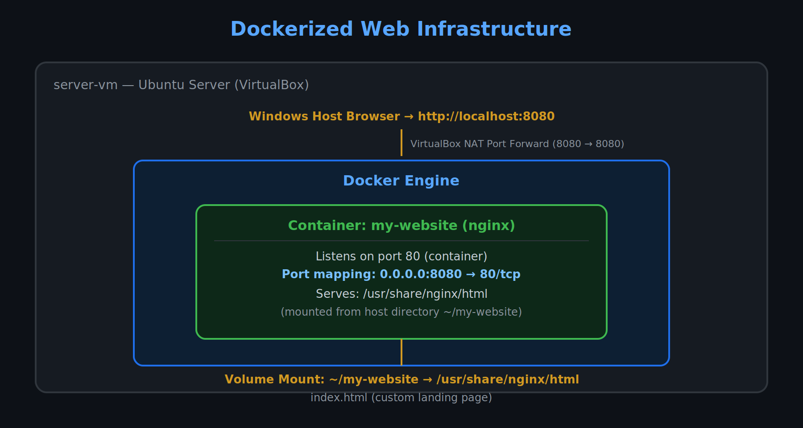

# Dockerized Web Infrastructure

A simple web server deployed inside a Docker container on an Ubuntu Server VM. This project demonstrates containerization fundamentals: running Nginx in Docker, exposing it via port mapping, serving custom content through a volume mount, and troubleshooting a real-world DNS issue inside the container runtime.



## What this covers

- **Docker installation** — Installed Docker Engine on Ubuntu Server using the official install script, and configured the user to run Docker without `sudo`.
- **Running containers** — Pulled and ran the official Nginx image, with port mapping (`8080:80`) to expose the container's web server to the host.
- **Custom content via volumes** — Used a Docker volume mount (`-v`) to serve a custom `index.html` from the host filesystem instead of the default Nginx page.
- **Network troubleshooting** — Diagnosed and resolved a DNS resolution failure that prevented Docker from pulling images from Docker Hub.
- **Host access via port forwarding** — Configured VirtualBox NAT port forwarding so the containerized site is viewable from the host's browser.

## Architecture

| Component | Details |
|---|---|
| Host | Ubuntu Server VM (VirtualBox), reused from the networking lab |
| Container | `nginx` (official image) |
| Port mapping | `8080` (host) → `80` (container) |
| Volume mount | `~/my-website` (host) → `/usr/share/nginx/html` (container) |
| Access | `http://localhost:8080` via VirtualBox port forwarding |

## Setup steps

1. **Install Docker**:
```bash
   curl -fsSL https://get.docker.com -o get-docker.sh
   sudo sh get-docker.sh
   sudo usermod -aG docker $USER
```
2. **Run Nginx in a container**:
```bash
   docker run -d --name my-website -p 8080:80 nginx
```
3. **Serve custom content** by creating a local folder with an `index.html`, then re-running the container with a volume mount:
```bash
   docker run -d --name my-website -p 8080:80 -v ~/my-website:/usr/share/nginx/html nginx
```
4. **Expose to the host** via VirtualBox: Settings → Network → Adapter 1 (NAT) → Port Forwarding → map host port `8080` to guest port `8080`.

## Troubleshooting case study: Docker DNS failure

**Problem:** `docker run nginx` failed with a DNS resolution error when pulling the image: